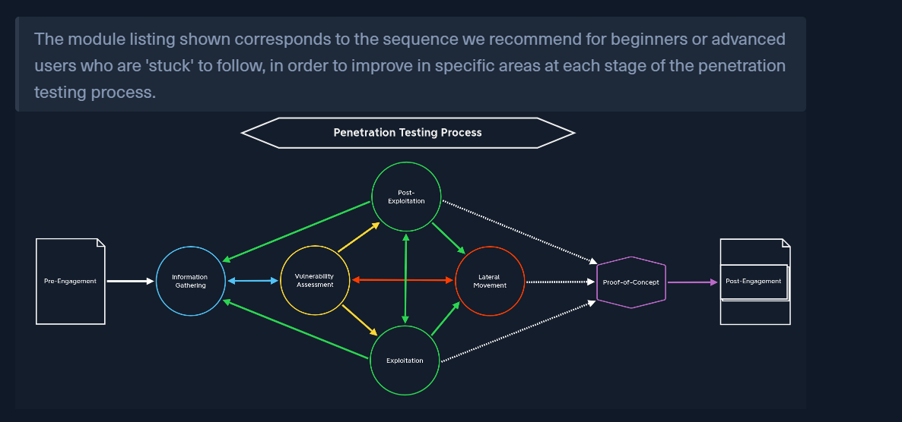
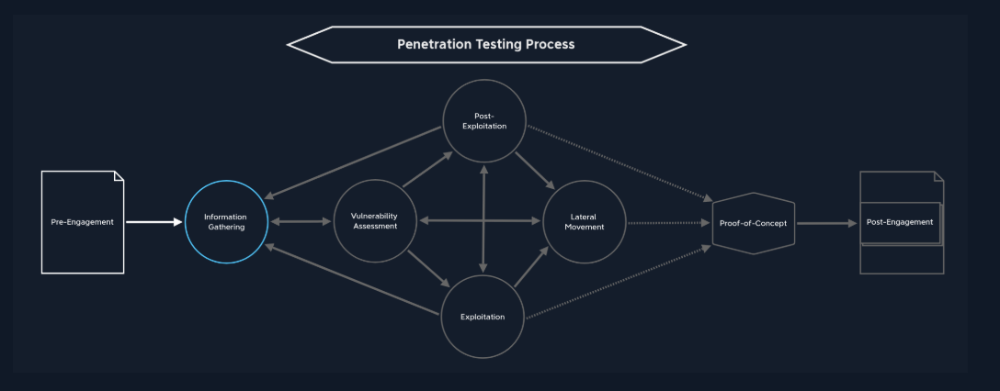

Il y a un ordre méthodologique pour apprendre à faire du pen test. 

Information Gathering : 
    - identify target systems

    - The customer may not give us any information 
        - we need to get an overview of the target before proceeding further. 

Il y a différents modules qui permettent d'apprendre tout cela : 
    - Learning Process (done)
    - Linux fundamentals (In progress)