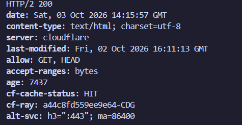
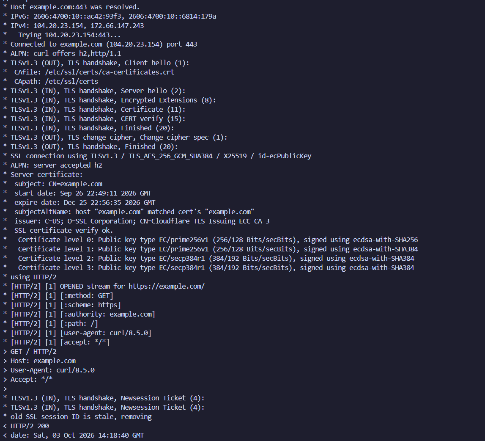
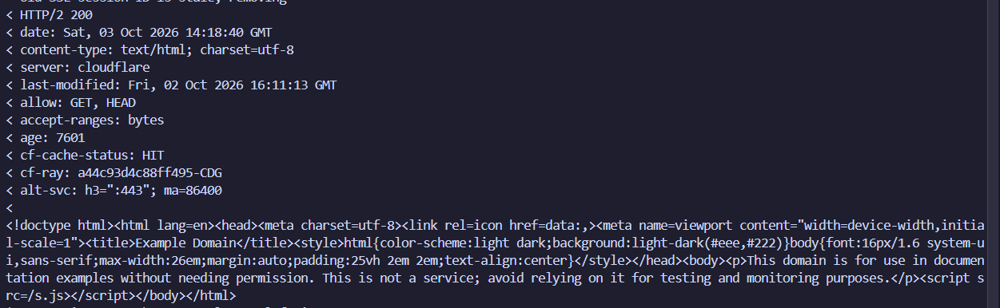
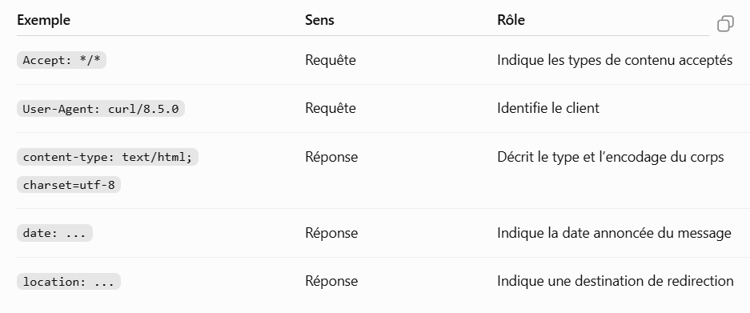
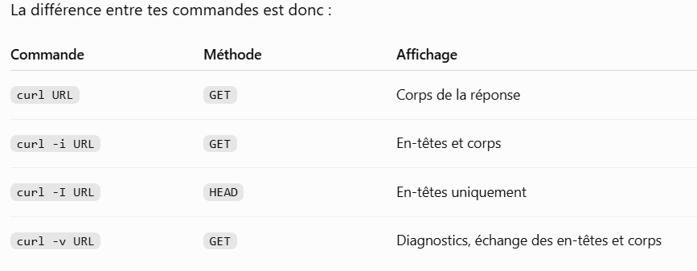
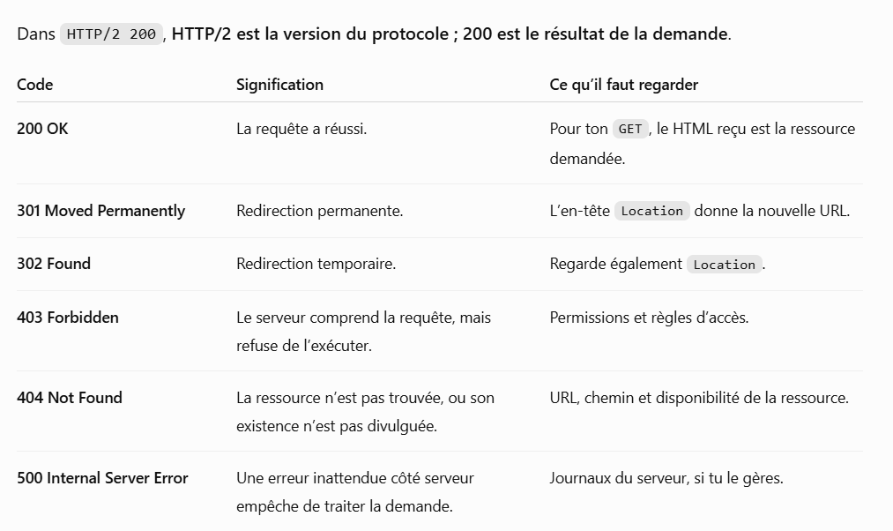
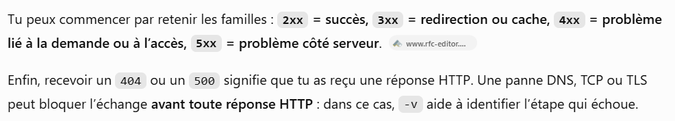

///// Prise de notes par rapport à la Session 3 sur HTTP ///// 

# Première commande : 

curl https://example.com

man curl : 
    - tool for transferring data from or to a server using URLs
    - support many protocols. (listed in the documentation)

Notre exemple donne : 
    - les différentes constructions en html du site 
    - Plus directement, cette commande permet de voir le code de la page envoyé par le serveur, et non le code qui fait fonctionner le serveur. 
    - curl envoie une requete HTTP au serveur et affiche le corps de sa réponse dans le terminal 

Ensuite on demande de faire : 

curl -I https://example.com

Cette commande renvoit les même statistiques mais de manières présentables : 

    - En fait, l'option -I demande uniquement les en tetes, sans le contenu HTML. 

Ensuite j'ai fais : 

curl -v https://example.com

Ici l'affichage est plus dense : (en voici un extrait) 

Le rôle de -v : 
    
    - signifie verbose
    - curl va afficher des détails sur la connexion et sur l'échange HTTP, tout en récupérant le contenu demandé. 

Pour lire la sortie : 
    - Préfixe * : informations de diagnostic de curl 
    - Préfixe > : Requete et en-tetes envoyés 
    - Préfixe < : Statut et en-têtes reçus
    - HTML qui suit : corps de la réponse 

Focus sur les termes suivant dans la commande curl -v : 

    - adresse
        // sert à savoir où envoyer la demande 
        // https : HTTP transporté dans une connexion protégée par TLS 
        // example.com : Nom de domaine à contacter 
        //  '/' : Chemin de la ressource demandée 
        // Dans la capture, on a : 
            * Host example.com:443 was resolved.
            * IPv4: 104.20.23.154, 172.66.147.243
            * Trying 104.20.23.154:443...
            // Le DNS traduit le nom de domaine en adresse IP. 
            // Curl tente ensuite de joindre l'une de ces adresses sur le port 443 (port utilisé par défaut par HTTPS)

    - connexion
        // sert à établir le canal de communication 
        // Dans la capture de la commande, on a : 
            * Connected to example.com (...) port 443
            // La connexion TCP est établie. 
            // Les lignes TLS handshake montrent la négociation TLS : le client et le serveur établissent les paramètres de protection de l'échange. 
        // Dans la capture on a : 
            * SSL certificate verify ok.
            // indique que la vérification du certificat a réussi. 
            // cela concerne l'identité du serveur et la confiance dans son certificat 
            // cela ne garantit pas la qualité du contenu du site
        // Dans la capture, on a : 
            * ALPN: curl offers h2,http/1.1
            * ALPN: server accepted h2
            // Le client propose plusieurs versions de HTTP
            // Le serveur choisit HTTP/2 désigné par h2. 

    - requête
        // c'est ce que le client demande 
        // La capture affiche : 
            > GET / HTTP/2
            > Host: example.com
            > User-Agent: curl/8.5.0
            > Accept: */*
        // GET : demander à récupérer une ressource
        // '/' : Demander la ressource à la racine du site 
        // HTTP/2 : Version du protocole utilisé 
        // Host : Nom du site visé 
        // User-Agent : Identification du client, ici curl 
        // Accept : */* : Le client accepte tous les types de contenu

        // Infos supp : HTTP/2 utilise des trames binaires -> ces lignes constituent une présentation lisible de l'échange par curl.

    - response
        // c'est ce que renvoie le serveur 
        // Dans la capture, on a: 
            < HTTP/2 200
            < date: Sat, 03 Oct 2026 14:18:40 GMT
        // Une réponse HTTP contient un code de statut, des en-têtes et éventuellemet un corps 
        // la capture en entier de la réponse est : 

        
    - headers
    // ce sont les informations qui accompagnent le contenu 

    - status code

Ces significations sont définies par la norme HTTP. 

Pour suivre automatiquement une redirection on fait la commande : 
curl -vL https://example.com

Sans le -L curl ne suit pas les redirections HTTP par défaut.

Pourquoi il faut apprendre ces codes : 

- Ils donnent une première direction pour chercher un problème. 

- vérifier le contenu avec 200, la destination avec 301/302, les permissions avec 403, le chemin avec 404 et le fonctionnement du serveur avec 500.

