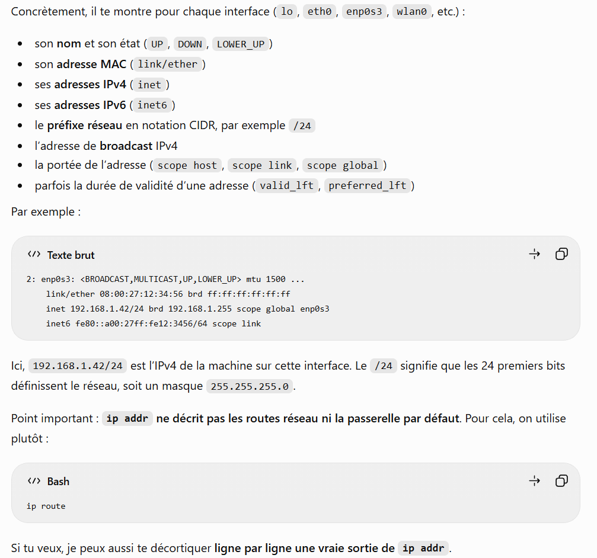
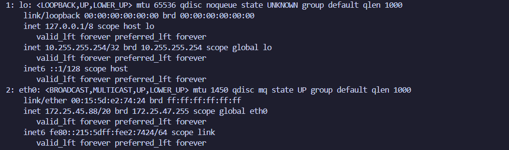
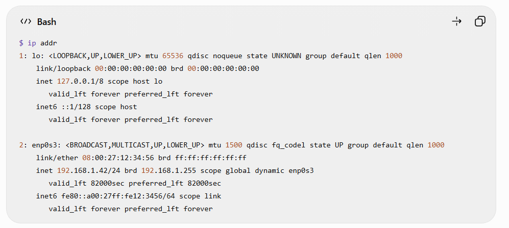
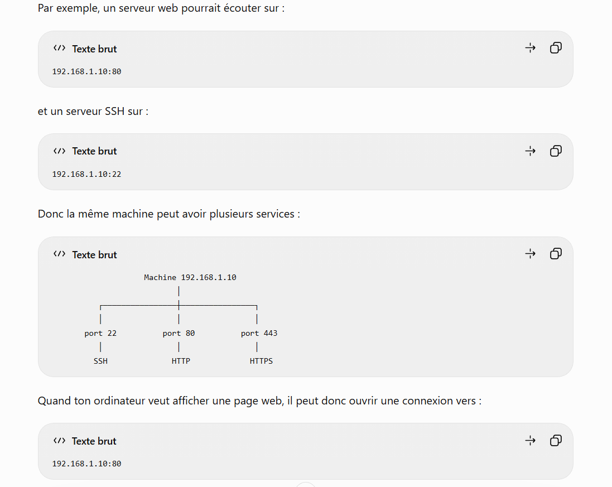

//// Prise de note à propos des adresses IP //// 

Il est possible de faire la commande ip addr pour observer l'interface des différentes adresses IP 

A propos de la commande ip addr : 

    - affiche les adresses IP
    - affiche l'état des interfaces réseau 

127.0.0.1 désigne ma propre machine
Généralement, une adresse du type : 192.168.x.x correspond à un réseau local. 

Exemple après avoir fait ip addr : 

Selon ChatGPT_Plus, on peut avoir la description d'un exemple ip addr de la manière suivante ; 

lo -> loopback. C'est une interface réseau virtuelle permettant à la machine de communiquer avec elle meme. 

<LOOPBACK, UP, LOWER_UP> donne plusieurs drapeaux d'état. 
LOOPBACK indique que c'est une interface de boucle locale. 
UP signifie que l'interface est activée administrativement. 

LOWER_UP signifie que la couche réseau inférieure est opérationnelle. 

mtu 65536

MTU : signifie Maximum Transmission Unit. C'est la taille de maximale d'un paquet pouvant être transmis sans fragmentation à ce niveau. 

(Regarder conversation Chat pour plus de détails)

A propos des ports : 

ANALOGIE : 
IP = adresse de l'immeuble 
Port = numéro de l'appartement 

Une machine peut avoir plusieurs services accessibles : 
22 -> SSH 
53 -> DNS 
80 -> HTTP 
443 -> HTTPS 

"Un programme écoute éventuellement sur un port, et un client peut tenter de s'y connecter" 

A propos de TCP et UDP : 

Pour le moment : 

TCP / 
- Connexion établie; 
- fiable; 
- contrôle de l'ordre des données. 

UDP /
- pas de connexion persistante; 
- plus simple; 
- pas de garantie de livraison au même niveau 

Pourquoi certaines applications préfèrent-elles la fiabilité et d'autre la rapidité ? 

    - certaines ont besoin que toutes les données arrivent correctement et dans le bon ordre
    - d'autres préfèrent recevoir les données le plus rapidement possible meme si quelques infos sont perdues en chemin. 

    - Avec TCP , la prio est la fiabilité. TCP vérifie que les données arrivent et les remet en morceaux dans le bon ordre et peut retransmettre ce qui a été perdu. 

    - Avec UDP les données sont envoyées sans attendre autant de confirmations. Il peut donc être plus rapide et avoir moins de latence.

A propos de DNS : 

faire la commande : nslookup example.com
ou 
dig example.com

DNS transforme un nom compréhensible pour un humain en information exploitable par le réseau. 

A propos de la commande ping : 

test sur ping example.com

puis sur ping 127.0.0.1

Pour le moment, comprendre que : 
    - ping peut permettre de tester la joignabilité via ICMP, mais que l'absence de réponde à un ping ne signifie pas forcément qu'une machine est hors ligne ! 

