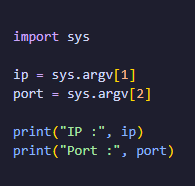
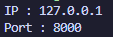
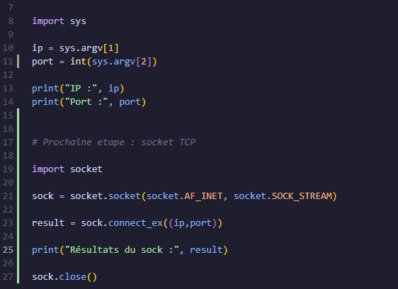
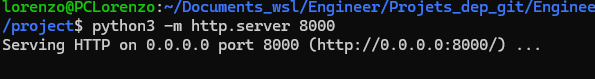
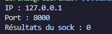
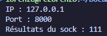
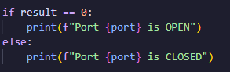
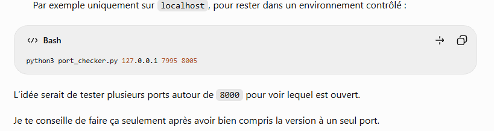
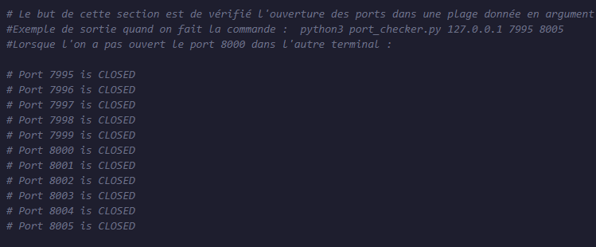

Prise de note par rapport à la session 4 de la première semaine de découverte de cybersécurité 

Mon premier programme réseau : 

Création du fichier port_checker.py 

commande : python port_checker 127.0.0.1 8000

Le port 8000 ici sert comme port de développement pour lancer facilement un petit serveur Web local sans toucher au port HTTP standard 80. 

( Par exemple : python3 -m http.server 8000 signifie : lance un serveur http et fais le écouter sur le port 8000)

/// La première chose à faire pour la suite : 

    // Récupérer les arguments données dans le terminal 

Pour cela on remplace le contenu du fichier python par des instructions avec import sys et print(sys.argv)

Pour le moment on a cela dans le python : 

Puis en lancant la commande python3 port_checker 127.0.0.1 8000 à nouveau on récupère : 

sys.argv[0] → 'port_checker.py'
sys.argv[1] → '127.0.0.1'
sys.argv[2] → '8000'

Puis on peut modifier le code python pour obtenir quelque chose comme cela : 

Code python : 

Résultat après compilation de la meme commande : 

A ce stade le port 8000 est considéré comme du texte, il est alors possible de modifier cela dans le code pour récupérer l'entier correspondant au port : 

port = int(sys.argv[2])

A partir de cet exemple, on peut retenir que le programme est capable de récupérer les paramètres donnés par l'utilisateur 

///// Prochaine étape : socket TCP 

On ajoute dans le code python : 

import socket 

sock = socket.socket(socket.AF_INET, socket.SOCK_STREAM)

Explication : 
    - socket.AF_INET -> "je veux utiliser des addresses IPv4"
    - socket.SOCK_STREAM -> "je veux utiliser une socket de type flux, donc TCP"

Conceptuellement : 
    socket(AF_INET, SOCK_STREAM)
       │          │
       │          └── TCP
       └───────────── IPv4

Pour tenter une première connexion : 

Le code à ce stade devient  : 

Puis dans un premier terminal je lance la commande : 

python3 -m http.server 8000

On laisse le terminal ouvert puis dans le second, on fait : 

python3 port_checker.py 127.0.0.1 8000

Si cela fonctionne, ici on est censé obtenir Résultats = 0, comme ici : 

Ici : connexion réussie = 0 

On peut à présent Ctrl + C pour stopper le serveur HTTP 

On peut tenter de relancer la commande du second terminal pour observer un autre résultat : 

Sous Linux : 111 -> connexion refusée 

On peut alors modifier le port_checker en conséquence pour afficher dans le terminal une meilleure réponse : 

Ainsi, le mécanisme pour le moment est : 
127.0.0.1:8000
      │
      ▼
création socket TCP
      │
      ▼
tentative de connexion
      │
      ├── succès → port OPEN
      │
      └── échec  → port CLOSED

Vocabulaire : 

    - port ouvert : lorsque un service écoute dessus et accepte une connexion
    - port fermé : aucun service n'accepte actuellement la connexion à cet emplacement

Ainsi pour le moment on peut résumer ce que l'on vient de créer de la manière suivante : 

Une socket permet à un programme de communiquer via le réseau.

AF_INET = IPv4
SOCK_STREAM = TCP

connect_ex((ip, port)) tente une connexion TCP.

Retour 0 :
connexion réussie.

Retour différent de 0 :
échec de connexion.

Autre expérience : 

Dans le terminal 1, on lance le serveur: 
python3 -m http.server 8000

Dans le terminal 2, on lance le checker:
python3 port_checker.py 127.0.0.1 8000

Terminal 1
└── serveur HTTP écoute sur le port 8000

Terminal 2
└── ton script essaie de se connecter au port 8000

On observe bien les modifs dans le code python sur le port "ferme" et "ouvert" en fonction de l'exécution. 

Pour finir la Session 4, on peut tester 3 étapes d'améliorations du checker : 
    - Ajout d'un timeout 
    - Ajout d'une vérification des argumentsd 
    - faire une petite version "scan de plage" en bonus 

Le tout en documentant a chaque nouvelle étape :

1/ Ajout du timeout : 

    // Pour éviter qu'une tentative de connexion reste bloquée trop longtemps. 
    // sock.settimeout(1)

2/ Vérification des arguments : 

    // Pour éviter une erreur si on lance juste : python3 port_checker.py 
    if len(sys.argv) != 3:
    print("Usage: python3 port_checker.py <ip> <port>")
    sys.exit(1)

3/ Version "scan de plage" en bonus :

    // Il faut faire des modifications dans le port_checker donc j'ai fais un autre script que j'ai testé puis mis en commentaire dans le meme fichier .py

    Amélioration :
    Le programme accepte désormais une plage de ports.

Arguments :
sys.argv[1] = IP
sys.argv[2] = port de début
sys.argv[3] = port de fin

La boucle range(start_port, end_port + 1) permet de tester
chaque port un par un.

Une nouvelle socket est créée pour chaque port.

Questions que je me pose encore :
- Comment scanner plusieurs ports ?
- Pourquoi un scan peut être lent ?
- Quelle différence entre mon script et Nmap ?
- Comment savoir quel service tourne derrière un port ?