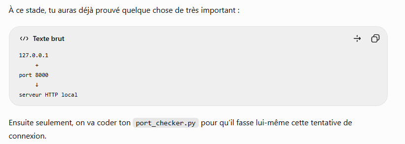
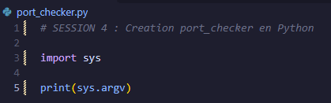
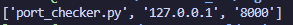

Prise de note par rapport à la session 4 de la première semaine de découverte de cybersécurité 

Mon premier programme réseau : 

Création du fichier port_checker.py 

commande : python port_checker 127.0.0.1 8000

Le port 8000 ici sert comme port de développement pour lancer facilement un petit serveur Web local sans toucher au port HTTP standard 80. 

( Par exemple : python3 -m http.server 8000 signifie : lance un serveur http et fais le écouter sur le port 8000)

/// La première chose à faire pour la suite : 

    // Récupérer les arguments données dans le terminal 

Pour cela on remplace le contenu du fichier python par des instructions avec import sys et print(sys.argv)

Pour le moment on a cela dans le python : 

Puis en lancant la commande python3 port_checker 127.0.0.1 8000 à nouveau on récupère : 

sys.argv[0] → 'port_checker.py'
sys.argv[1] → '127.0.0.1'
sys.argv[2] → '8000'

