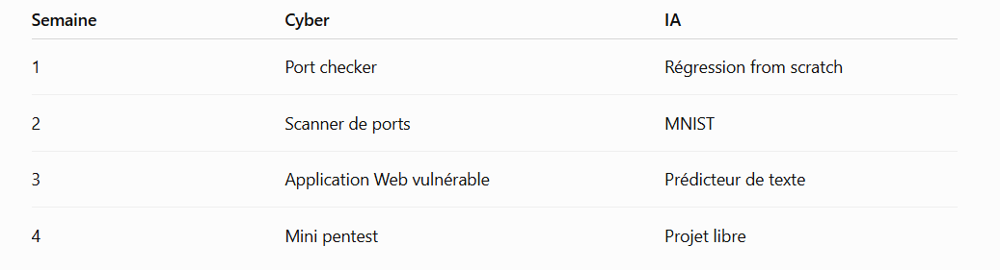

/////// Ceci est un début de prise de note pour des prochains projets ////// 

/// Objectifs : /// 

- Décourvrir des prochaines spécialités de 3e année d'informatique pour savoir laquelle choisir 

1/ Cybersécurité 
2/ IA 

Méthode ; 

Pendant 1 mois : 

- Choix d'une spécialité
- Suivre un programme
- Créer des projets
- Tenir des dépots GitHub pour les différents projets 

// MINIMUM 5H/6H par semaine // 

Se donner un livrable obligatoire par semaine en fonction du projet 

1h30 de théorie/Documentation 
2h de pratique guidée 
1h30 de projets personnels
30 min pour gérer les dépots/ journals etc 

/////// PROGRAMME 1 : Cybersécurité -- 1 mois, 20 à 25h /////// 

Semaine 1 : Fondamentaux systèmes et réseaux 

Objectif : comprendre l’environnement avant de toucher aux outils offensifs.

- Linux : fichiers, permissions, utilisateurs, processus
- terminal
- IP, TCP, UDP
- ports
- DNS
- HTTP/HTTPS
- client/serveur
- bases de SSH

Répartition conseillée :
1 h 30 théorie
- réseau
- couches TCP/IP
- ports
- DNS
- HTTP
- permissions Linux
2 h pratique
- terminal Linux
- curl
- ping
- dig / nslookup
- ssh
- grep
- find
- chmod
- ps

1 h 30 projet
Crée un petit port checker en Python.

Version 1 : 
IP + port -> ouvert / fermé 

Puis ajouter : 
timeout 
plage de ports
affichage propre

30 minutes de journal : 
Ecrire ce que j'ai compris
ce qui reste flou 
3 commandes apprises 
1 schéma réseau 
l'avancée du projet 

Livrable semaine 1 : 
notes/networking.md
notes/linux-basics.md
projects/port-checker/
journal/week01.md

Semaine 2 - Reconnaissance et sécurité offensive 

Objectif : apprendre comment on observe une machine avant de chercher une vulnérabilité.
reconnaissance
énumération
services
versions
surfaces d’attaque
CVE
vulnérabilité vs exploit
logique d’un pentest

1 h 30 théorie
Étudie une méthodologie simple :
Reconnaissance
→ Enumeration
→ Vulnerability identification
→ Exploitation
→ Privilege escalation
→ Reporting

2 h pratique
Fais des labs débutants sur TryHackMe ou HTB Academy.
- nmap
- découverte de services
- interprétation des résultats
- identification d’informations intéressantes
Ne cherche pas la difficulté maximale.
Le but est de comprendre pourquoi faire chaque commande.

1 h 30 projet
Améliore ton scanner Python.
Ajoute :
- scan d’une plage de ports
- récupération éventuelle de bannière
- temps d’exécution
- export JSON ou texte
Tu obtiens un petit outil personnel.

30 min journal
Documente un lab complet :
Target
Reconnaissance
Ports trouvés
Services
Hypothèses
Ce que j’ai appris

Livrable semaine 2 : 
notes/pentest-methodology.md
labs/lab01.md
projects/port-scanner-v2/
journal/week02.md

Semaine 3 — Sécurité Web
C’est ici que le mois devient vraiment concret.
Travaille :
- HTTP request / response
- cookies
- sessions
- authentification
- contrôles d’accès
- injections
- erreurs de configuration
- notions OWASP

1 h 30 théorie : 
Concentre-toi sur quatre familles :
Broken Access Control
Injection
Authentication Failures
Security Misconfiguration

Tu n’as pas besoin de maîtriser tout l’OWASP Top 10.

2 h pratique
Fais quelques labs de sécurité Web.
Idéalement :
- un lab d’authentification
- un lab de contrôle d’accès
- un lab d’injection simple
Essaie aussi Burp Suite au moins une fois pour observer une requête HTTP.
1 h 30 projet
Je te conseille ici le projet :
Mini-banque vulnérable
Tu crées une petite application avec :
/login
/account
/transfer

Pas besoin d’interface magnifique.
Version initiale :
- deux utilisateurs
- solde
- transferts
- historique
Puis introduis volontairement une faiblesse simple dans ton environnement local de test.
L’objectif n’est pas simplement de la créer, mais d’écrire ensuite :
Pourquoi elle existe
Comment elle pourrait être exploitée
Comment la corriger

30 min journal
Une fiche :
HTTP request anatomy
cookies
sessions
authentication
authorization

Livrable semaine 3
notes/web-security.md
labs/web-lab01.md
projects/vulnerable-bank/
journal/week03.md

Semaine 4 — Mini pentest complet
5 à 7 h
Cette semaine doit être différente.
Très peu de cours.
Tu prends un lab débutant que tu ne connais pas et tu essaies de travailler en autonomie.
Répartition :
30 min préparation
Tu définis ta méthodologie.
3 h pratique autonome
Tu fais :
Reconnaissance
→ Enumeration
→ Investigation
→ Exploitation
→ compréhension

Si tu bloques, ne regarde pas immédiatement la solution.
Je te conseille une règle :
20–30 minutes de recherche autonome avant un indice.
1 h rapport
Tu écris un vrai mini rapport.
# Security Assessment

## Scope

## Reconnaissance

## Findings

## Vulnerability

## Exploitation

## Impact

## Mitigation

## Lessons learned

1 h projet
Nettoie ton projet du mois :
- README
- arborescence
- commentaires
- captures pertinentes
- documentation
30 min bilan
Réponds à :
Qu’est-ce que j’ai préféré ?
Réseau ?
Web ?
Pentest ?
Programmation d’outils ?
Recherche ?

Qu’est-ce qui m’a frustré ?

Qu’est-ce que j’aimerais approfondir ?

cybersecurity-learning/
│
├── README.md
│
├── notes/
│   ├── networking.md
│   ├── linux-basics.md
│   ├── pentest-methodology.md
│   └── web-security.md
│
├── projects/
│   ├── port-scanner/
│   └── vulnerable-bank/
│
├── labs/
│   ├── lab01.md
│   ├── lab02.md
│   └── final-assessment.md
│
└── journal/
    ├── week01.md
    ├── week02.md
    ├── week03.md
    └── week04.md

Et surtout : tu auras déjà touché à réseau + Linux + Python + Web + pentest.

Programme Intelligence Artificielle — 1 mois, 20–25 h

Pour l’IA, j’utiliserais le temps supplémentaire principalement pour renforcer les fondements mathématiques et l’implémentation.

Semaine 1 — Comprendre le Machine Learning
5 à 6 h
Objectif :
comprendre ce que signifie réellement “entraîner un modèle”.
Tu travailles :
- dataset
- feature
- label
- train / validation / test
- modèle
- paramètres
- loss
- gradient descent
- overfitting
- learning rate
1 h 30 théorie
Revois :
\[
\hat y = wx+b
\]
Puis :
\[
MSE = \frac1n\sum (y_i-\hat y_i)^2
\]
Et surtout :
\[
\theta_{t+1}
=
\theta_t-\eta\nabla L(\theta_t)
\]
Essaie de comprendre le sens géométrique du gradient.
2 h pratique
NumPy uniquement.
Manipulation de :
- vecteurs
- matrices
- produit matriciel
- broadcasting
- statistiques simples
1 h 30 projet
Régression linéaire from scratch
Pas de scikit-learn.
Pas de PyTorch.
Tu écris toi-même :
predict()loss()gradient()train()

Dataset possible :
surface → prix

ou :
heures de révision → résultat

Puis affiche la loss au fil des itérations.
30 min fiche
Crée :
01_machine_learning.md
02_gradient_descent.md

Semaine 2 — Réseaux de neurones + PyTorch
5 à 6 h
Objectif :
comprendre pourquoi un réseau neuronal est une généralisation de ce que tu viens de faire.
1 h 30 théorie
Travaille :
- neurone
- poids
- biais
- couche
- activation
- ReLU
- sigmoid
- softmax
- forward pass
- backpropagation
Conceptuellement :
Input
 ↓
Linear
 ↓
ReLU
 ↓
Linear
 ↓
Output

1 h PyTorch
Apprends :
torch.Tensornn.Modulenn.Linearloss.backward()optimizer.step()

Mais à chaque fois pose-toi :
Quelle partie PyTorch automatise-t-il ?

2 h projet
MNIST ou Fashion-MNIST
Construis ton premier classificateur.
Analyse :
- loss
- accuracy
- erreurs
Et surtout crée un dossier :
misclassified/

où tu observes quelques mauvaises prédictions.
30 min fiche
03_neural_networks.md
04_backpropagation.md
05_pytorch.md

Semaine 3 — Texte, embeddings et Transformers
5 à 6 h
Là tu rentres réellement dans le monde des LLM.
Mais avec des fondations.
1 h 30 théorie
Comprends :
texte
→ tokenisation
→ tokens
→ embeddings
→ attention
→ transformer
→ logits
→ probabilities
→ next token

Travaille notamment :
- tokenisation
- vocabulary
- embedding
- contexte
- self-attention
- Transformer
1 h maths
Étudie :
\[
Attention(Q,K,V)
=
softmax
\left(
\frac{QK^T}{\sqrt{d_k}}
\right)V
\]
Pas besoin d'une maîtrise totale.
Mais tu dois pouvoir expliquer à voix haute ce que représentent :
Q
K
V
QKᵀ
softmax

2 h projet
Fais un petit modèle de texte beaucoup plus simple qu’un LLM.
Par exemple :
prédiction du caractère suivant
Entrée :
"bonjou"

Sortie :
"r"

Commence même avec une approche naïve.
Puis améliore-la.
Cela te donne une première intuition du next-token prediction.
30 min documentation
06_embeddings.md
07_attention.md
08_transformers.md

Semaine 4 — Projet IA autonome
5 à 7 h
Cette semaine, choisis un seul projet.
Pas quatre.
Tu dois passer davantage de temps à construire.
Option 1 — Détection de fraude bancaire
Très intéressant techniquement.
Dataset artificiel :
amount
hour
country
merchant
account_age
previous_transactions

Sortie :
fraud / normal

Tu analyses :
- accuracy
- precision
- recall
- confusion matrix
Excellent pour découvrir que :
99 % d’accuracy peut parfois être catastrophique.
Option 2 — Reconnaissance de formes
Tu génères :
- cercles
- carrés
- triangles
Puis ton modèle les reconnaît.
Tu peux progressivement ajouter :
- rotation
- bruit
- tailles différentes
Très ludique.
Option 3 — Analyseur de sentiment
Entrée :
"Ce film était incroyable"

Sortie :
positive

Tu apprends :
- traitement du texte
- embeddings
- classification
Option 4 — Mini réseau neuronal from scratch
Probablement le meilleur pour apprendre.
NumPy seulement.
Tu écris :
Linear
ReLU
Loss
Backward
Optimizer

C'est difficile mais excellent pédagogiquement.
Option 5 — Mini générateur de texte
Plus ambitieux.
Tu entraînes un petit modèle sur :
- Shakespeare
- poésie libre
- articles
- tes propres notes
Il génère ensuite du texte caractère par caractère ou token par token.
Tu touches directement à l’idée derrière les modèles de langage.
Répartition de la dernière semaine
Je ferais :
30 min : conception
3 h : code
1 h : tests et expériences
1 h : README
30 min : fiche bilan

Si tu as une 6e heure :
analyse les erreurs de ton modèle.
Pas besoin de rajouter des fonctionnalités.
Résultat IA après ~22 h
ai-learning/
│
├── README.md
│
├── notes/
│   ├── machine-learning.md
│   ├── gradient-descent.md
│   ├── neural-networks.md
│   ├── backpropagation.md
│   ├── pytorch.md
│   ├── embeddings.md
│   ├── attention.md
│   └── transformers.md
│
├── projects/
│   ├── linear-regression-from-scratch/
│   ├── mnist-classifier/
│   └── final-project/
│
├── experiments/
│   └── next-character-prediction/
│
└── journal/
    ├── week01.md
    ├── week02.md
    ├── week03.md
    └── week04.md